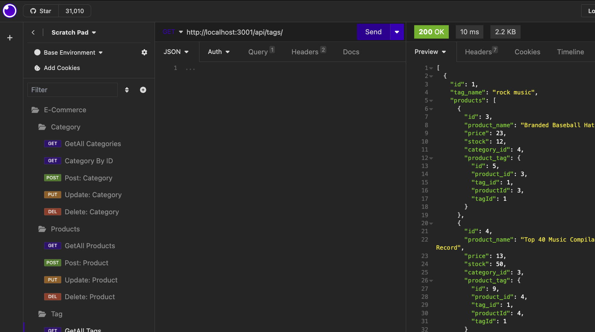

# e-commerce
An app to empower consumers to conveniently engage in online buying.


## Description and Motivation
This application is to get a feel of the world of e-commerce and how the data might be stored in a database. The commerce-type database might have things like products, prices, styles, tags relating to one another and interdependancies with each table withing: products have tags (or associations, colors, types and so on), along with categories (ike shirts, shoes, pogo-sticks) and they are all inter-related.

The reasoning for making this application is so that you can be given a starting point for your own backend database storage and front end ability to add, delete, change or view your products. 

Here is a view of what you might see in a products table. This one includes all categegories, but as you'll see later, you can view, edit and update them:


## Table of Contents

* [Usage](#usage)
* [Technology Used](#technology-used)
* [Repo Location](#repo)
* [Screenshots of Application](screenshots-of-application)
* [Learning Points](#learning-points)
* [Code Snippets](#code-snippets)
* [Contact Info](#contact-info)

## Usage

This application is a locally deployed app. You will be building it, setting up a database, and be able to manipulate data in a E-Commerce fashion with backeng DB storage capability. Below you will find 2 videos of how to install, and then how to manage e-commerce data with this application.

Here is the link to the Deployed Application ...
[E-Commerce Video for Installation of Application](https://watch.screencastify.com/v/8BK5PCJE0EXgWbkzxNmA)
[E-Commerce Video describing functionality/performance of application](https://watch.screencastify.com/v/bKiZZ5geWoeTEvLgsZIU)


Some key commands locally will be:
A couple of DB commands to get it set up:
```
DROP DATABASE IF EXISTS ecommerce_db;
CREATE DATABASE ecommerce_db;
```
Then console commands to install packages & dependancies, seed the DB, and start the application
```
npm install
node seed/index.js
node server.js

```

## Technology Used 

| Technology Used         | Resource URL           | 
| ------------- |:-------------:| 
| Heroku | [https://www.heroku.com//](https://www.heroku.com/)     |    
| Git | [https://git-scm.com/](https://git-scm.com/)     |    
| NPM and ExpressJs | [https://www.npmjs.com/package/express](https://www.npmjs.com/package/express)|
| NodeJs | [https://nodejs.org/en](https://nodejs.org/en)|
| Screencastify | [https://www.screencastify.com/](https://www.screencastify.com/)|
| ChatGPT | [https://openai.com/blog/chatgpt](https://openai.com/blog/chatgpt)|

There is also javascript, Google Search, and Youtube university. 

## Repo 

[GitHub Repo for E-Commerce Applicaiton](https://github.com/flimits/e-commerce)


## Screenshots of Application
---
There are a lot of screen shots that could be taken for each aspect of the app. However, here are key screenshots since the videos above show you far more detail into the performance of the application.

If you open up the application Insomnia, you will be able to view the tables clearly and manipulate them with Calls. 

### Here is Categories (the first thing you see.).

---
---
### This is the view all Products in DB.

---
---
### View all tags in DB.

---
---
### You might want to delete a category

---
---
### Add a category.

---
---
### Drop a DB Table

---


## Learning Points 

The building out of this application uses ExpressJs server and Sequalize as its frameworks. Express JS server allows for interactive web-client interface and Sequalize being a modern Node.js ORM for MySql. We can now interact API like Insomnia to interact with the DB.

### Somee lessons a little more painful to add on it

Lesson here is the read the documentation and understand what Sequelize is doing under the hood and how ExpressJS uses it to make your database models, routes, and associatoins are far easier then running actual SQL commands within your code. 

It is not easy for me to understand, and I'm hoping it becomes more clear as I use it more and more.

## Code Snippets

There are two main parts to this setup from my point of view 
1 Setup of the Sequalize within Express server and
2 Data Models and Associations for the e-commerce database


- Here is how the sequalize is setup. First, within the server.js
```js
const express = require('express');
const routes = require('./routes');
// import sequelize connection
const sequelize = require('./config/connection');

const app = express();
const PORT = process.env.PORT || 3001;
```
- Use it within each of the various models you will have that describe your database, this is for Categories
```js
const { Model, DataTypes } = require('sequelize');

const sequelize = require('../config/connection.js');

class Category extends Model { }

Category.init(
  {
    id: {
```

- For the express js server route that allows us to view the Categories table, you would use this in yoru routes. This allows you to view all categories (as an example)...
```js
const router = require('express').Router();
const { Category, Product } = require('../../models');

// The `/api/categories` endpoint

router.get('/', async (req, res) => {
  try {
    // Use the findAll method on the Category model to fetch all categories
    const categoryData = await Category.findAll({
      include: [{ model: Product }], // Include associated Products
    });

    // Send the category data back to the user
    res.status(200).json(categoryData);
  } catch (err) {
    console.error(err);
    res.status(500).json(err);
  }
});
```

===

## Contact Info

| Name      |Email      | Github    | Portfolio |
|-----------|-----------|-----------|-----------|
|Jason       |flimits@gmail.com|https://github.com/flimits|https://github.com/flimits/my-portfolio/|


## Psuedo Code

In this case, teh Psuedo code done was within the routes files, like the category-routes.js, product-routes.js and tag-routes.js. It is realatively simle psuedo coding. not much was done here.